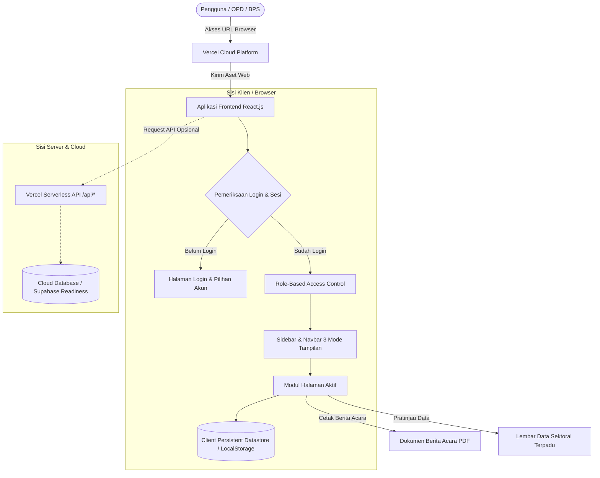

# BUKU PEDOMAN PENGGUNAAN SISTEM INFORMASI SIMPONITAS
**Badan Pusat Statistik (BPS) Kabupaten Pasaman — Provinsi Sumatera Barat**  
*Sinergi Pembinaan Statistik Sektoral melalui Penerbitan Kompromin Akurat dan Berkualitas*

---

## DAFTAR ISI
1. [Gambaran Umum Sistem](#1-gambaran-umum-sistem)
2. [Teknologi dan Arsitektur Sistem](#2-teknologi-dan-arsitektur-sistem)
3. [Alur Sistem](#3-alur-sistem)
4. [Struktur Menu](#4-struktur-menu)
5. [Hak Akses Pengguna](#5-hak-akses-pengguna)
6. [Panduan Penggunaan](#6-panduan-penggunaan)
7. [Pengelolaan Data](#7-pengelolaan-data)
8. [Keamanan dan Login](#8-keamanan-dan-login)
9. [Troubleshooting (Pemecahan Masalah)](#9-troubleshooting)
10. [Penutup](#10-penutup)

---

# 1. Gambaran Umum Sistem

### 1.1. Nama dan Tujuan Sistem
* **Nama Sistem**: **SIMPONITAS**
* **Kepanjangan**: *Sinergi Pembinaan Statistik Sektoral melalui Penerbitan Kompromin Akurat dan Berkualitas*
* **Instansi Pemilik**: Badan Pusat Statistik (BPS) Kabupaten Pasaman, Provinsi Sumatera Barat.
* **Inisiator & Pengembang**: Muhammad Rafi Tasrif, S.Tr.Stat (Pranata Komputer Ahli Pertama) dalam rangka Aktualisasi Latsar CPNS Golongan III BPS Tahun 2026.

**Tujuan Sistem SIMPONITAS**:  
SIMPONITAS dirancang sebagai platform layanan digital terpadu untuk memfasilitasi koordinasi, pengajuan layanan pembinaan, pendampingan penyusunan metadata, pemantauan pengumpulan data sektoral berkala, serta penerbitan dan pengarsipan dokumen Kompilasi Produk Administrasi (Kompromin) bagi seluruh Organisasi Perangkat Daerah (OPD) di lingkungan Pemerintah Kabupaten Pasaman sesuai prinsip Satu Data Indonesia (SDI).

### 1.2. Fungsi Utama Sistem
1. **Pusat Informasi dan Edukasi Pembinaan Statistik Sektoral**: Menyediakan gambaran tujuan pembinaan, landasan hukum (UU No. 16/1997, Perpres No. 39/2019), serta tahapan alur integrasi data dari produsen data hingga publikasi resmi BPS.
2. **Dashboard Pemantauan & Analitik KPI (Key Performance Indicator)**: Menyajikan grafik interaktif progres pembinaan instansi, status dokumen Kompromin, frekuensi kegiatan, dan rekapitulasi capaian seluruh OPD.
3. **Pengelolaan Master Instansi OPD**: Mendokumentasikan basis data 23 instansi OPD Kabupaten Pasaman beserta pejabat penanggung jawab, kontak narahubung, dan alamat surel kedinasan.
4. **Layanan Pengajuan Permohonan Pembinaan Online**: Memfasilitasi OPD dalam mengajukan permohonan pembinaan statistik (Kompromin, Metadata Statistik MS-D, Rekomendasi Statistik Romantik, dan Konsultasi Teknis) serta memfasilitasi BPS dalam menyetujui, menjadwalkan ulang, dan mendisposisikan tim pembina.
5. **Pencatatan Riwayat & Penerbitan Berita Acara Resmi**: Merekam rekam jejak pelaksanaan pembinaan lengkap dengan notulen, perwakilan instansi, tim pembina, galeri foto dokumentasi (dengan fitur kompresi otomatis), serta fitur cetak Berita Acara Pembinaan berkop resmi.
6. **Repositori Publikasi Kompromin Daerah**: Katalog terpusat untuk menyimpan, memfilter status verifikasi (*Draft OPD*, *Dalam Penelaahan BPS*, *Terverifikasi & Diterbitkan*), serta mengunduh dokumen publikasi Kompromin.
7. **Pengumpulan & Pemantauan Aliran Data OPD**: Memantau pelaporan data statistik berkala per indikator (Triwulanan, Bulanan, Tahunan) dengan fitur **Pratinjau Lembar Data Sektoral Terpadu** sebelum pengunduhan dokumen lampiran.
8. **Knowledgebase (Perpustakaan Pengetahuan)**: Pusat unduhan dokumen regulasi, Standar Operasional Prosedur (SOP), buku panduan metadata, dan format template baku penyusunan data.
9. **Tata Kelola Pengguna & Peran (Role-Based Access Control / RBAC)**: Pengaturan hak akses berbasis 5 peran dengan matriks sakelar otorisasi (*toggle switch*) yang dapat disesuaikan sewaktu-waktu oleh Administrator BPS.

### 1.3. Permasalahan yang Diselesaikan
Sebelum adanya sistem SIMPONITAS, proses pembinaan statistik sektoral menghadapi beberapa kendala nyata:
* **Pengajuan Pembinaan Masih Manual**: Koordinasi pengajuan bimbingan teknis masih menggunakan surat fisik atau pesan singkat informal sehingga rentan luput dari pencatatan jadwal.
* **Jadwal Pembinaan Rentan Tumpang Tindih**: BPS kesulitan memetakan ketersediaan waktu tim pembina dengan jadwal usulan OPD secara terintegrasi.
* **Dokumentasi & Notulen Tercecer**: Bukti pelaksanaan, notulen kesepakatan indikator, dan dokumentasi foto sering tersimpan pada arsip pribadi masing-masing pegawai dan tidak terpusat.
* **Sulitnya Memantau Data Rutin OPD**: Pengumpulan data indikator berkala (triwulanan/tahunan) dari produsen data OPD sering mengalami keterlambatan karena tidak adanya pelacakan status tenggat waktu (*deadline*) dan status pengisian indikator yang transparan.
* **Akses Materi Pedoman Terbatas**: OPD sering kesulitan mencari format baku template Kompromin dan kamus metadata standar statistik yang valid.

---

# 2. Teknologi dan Arsitektur Sistem

### 2.1. Teknologi dan Framework yang Digunakan
Sistem SIMPONITAS dibangun dengan arsitektur web modern yang mengutamakan kecepatan akses, responsivitas tinggi pada semua perangkat, dan kemudahan pengoperasian bagi pengguna awam:

| Komponen | Teknologi yang Digunakan | Penjelasan & Peran |
| :--- | :--- | :--- |
| **Frontend Framework** | React.js (v18+) & Vite | Membangun antarmuka interaktif Single Page Application (SPA) yang cepat tanpa *reload* halaman penuh. |
| **Desain & UI Tokens** | Vanilla CSS3 Modern (CSS Variables) | Sistem desain responsif dengan warna aksen Pasaman Orange (`#f79039`), Glassmorphism, dan 3 pilihan mode tema (*Default*, *Biru Samudra*, dan *Mode Gelap*). |
| **Tipografi** | Plus Jakarta Sans (Google Fonts) | Tipografi resmi yang dirancang untuk keterbacaan tinggi pada laporan formal maupun dashboard digital. |
| **Ikonografi** | Lucide React | Ikon berbasis SVG murni yang konsisten, bersih, dan bebas dari emotikon informal. |
| **Kompresi Berkas** | Canvas Image Compressor Client-side | Fitur utilitas otomatis untuk mengompresi foto kegiatan agar muat cepat dan hemat ruang penyimpanan. |
| **Pencetakan Dokumen** | Native Browser Print Engine | Menghasilkan cetakan Berita Acara resmi berkop surat BPS Kabupaten Pasaman yang siap dicetak langsung atau disimpan sebagai PDF. |
| **Backend / API** | Node.js Serverless Functions (`api/`) | Endpoint API backend ringan tanpa server fisik (*serverless architecture*) untuk melayani request data pembinaan, kompromin, aliran data, dan role. |
| **Penyimpanan Data** | Hybrid Storage (`localStorage` + API) | Mekanisme sinkronisasi data lokal browser dengan skema data terstruktur untuk menjamin keutuhan data dan respon instan pengguna. |

### 2.2. Peran GitHub
GitHub berperan sebagai sistem kendali versi (*Version Control System*) terpusat untuk repositori kode sumber proyek:
* **Pelacakan Perubahan**: Mencatat seluruh riwayat penambahan fitur, penyempurnaan antarmuka, dan perbaikan galat secara transparan.
* **Manajemen Rilis**: Mengelola branch utama (`main`) sebagai sumber kode produksi yang siap diluncurkan.
* **Integrasi Berkelanjutan (CI/CD)**: Terhubung langsung dengan platform hosting Vercel. Setiap kali kode di-push ke GitHub, Vercel secara otomatis mendeteksi perubahan, menguji build, dan memperbarui website secara otomatis (*Continuous Deployment*).

### 2.3. Peran Vercel
Vercel berperan sebagai platform infrastruktur hosting awan (*Cloud Deployment Platform*):
* **Penyajian Antarmuka (Static Site Hosting)**: Menyajikan berkas build frontend hasil kompilasi Vite secara cepat ke seluruh pengguna di Indonesia melalui jaringan *Edge Network*.
* **Eksekusi Serverless API**: Menjalankan skrip backend di direktori `api/` (seperti `pembinaan.js`, `kompromin.js`, dll.) secara otomatis tanpa memerlukan server fisik yang menyala terus-menerus.
* **Keamanan SSL HTTPS**: Menyediakan sertifikat keamanan enkripsi 256-bit standar industri secara otomatis sehingga transmisi data terjamin keamanannya.
* **Konfigurasi Routing (`vercel.json`)**: Mengarahkan rute Single Page Application agar URL dapat diakses langsung tanpa galat *404 Not Found*.

### 2.4. Peran Supabase / Basis Data
* **Kondisi Implementasi Aktual**:  
  Saat ini sistem SIMPONITAS menggunakan arsitektur **Client-Side Persistent Datastore** (`localStorage` engine) yang terstruktur rapi berdasarkan skema entitas data BPS Pasaman. Data pengguna, daftar OPD, permohonan pembinaan, notulen, kompromin, aliran data, serta konfigurasi hak akses tersimpan secara persisten pada browser pengguna dan disinkronkan dengan *mock baseline data*.
* **Peran Supabase (Rencana Pengembangan Lanjutan)**:  
  Platform Supabase (PostgreSQL Database, Supabase Auth, dan Supabase Storage) disiapkan sebagai arsitektur basis data relasional awan terpusat pada tahapan pengembangan berikutnya untuk memfasilitasi sinkronisasi multi-pengguna antar perangkat secara langsung (*real-time multi-tenant database*).

### 2.5. Hubungan Antar Komponen dan Diagram Alur Sistem



---

# 3. Alur Sistem

### 3.1. Alur Utama Pengoperasian Sistem
Alur kerja umum SIMPONITAS berjalan secara berurutan sebagai berikut:

```
[1. LOGIN] ──> [2. DASHBOARD] ──> [3. NAVIGASI MENU] ──> [4. PROSES KERJA] ──> [5. DATABASE] ──> [6. OUTPUT]
```

1. **Login (Autentikasi)**: Pengguna mengakses website, memasukkan Nomor Induk Pegawai (NIP) atau alamat surel kedinasan beserta kata sandi yang terdaftar. Alternatifnya, pengguna dapat menggunakan tombol *Quick Fill Akun Demo* atau tombol *Masuk sebagai Pengguna Publik / Tamu*.
2. **Dashboard (Pemantauan Awal)**: Sistem mengidentifikasi hak akses peran (*Role*) pengguna dan menampilkan ringkasan indikator kinerja utama (KPI), status permohonan pembinaan, grafik kompromin, serta pintasan navigasi cepat.
3. **Navigasi Menu**: Pengguna memilih modul yang diinginkan pada bilah navigasi samping (*Sidebar*) sesuai dengan tugas yang akan dilaksanakan.
4. **Proses Kerja**: Pengguna melakukan aksi bisnis sesuai perannya (mengajukan usulan, mengubah jadwal, mengisi nilai data dan mengunggah lampiran, menelaah dokumen, atau mengubah hak akses).
5. **Database (Penyimpanan & Sinkronisasi)**: Setiap perubahan data secara otomatis divalidasi dan disimpan ke dalam penyimpanan persisten sistem.
6. **Output (Hasil Keluaran)**: Sistem menyajikan hasil dalam bentuk status layanan terbarukan, cetakan Berita Acara Pembinaan bertanda tangan, pratinjau lembar data, atau unduhan dokumen publikasi.

### 3.2. Rincian Alur Proses Bisnis Utama

#### A. Alur Pengajuan dan Penjadwalan Layanan Pembinaan
1. **Pengajuan oleh OPD**: Pengguna Produsen Data OPD membuka menu **Layanan Pembinaan** ➔ menekan tombol **Ajukan Pembinaan Baru** ➔ mengisi nama narahubung (PIC), nomor kontak, jenis pembinaan, topik bimbingan, usulan tanggal, lokasi, serta deskripsi kebutuhan ➔ menekan **Kirim Permohonan**.
2. **Penelaahan oleh BPS**: Tim Pembina BPS menerima notifikasi permohonan berstatus *Menunggu Persetujuan*.
3. **Persetujuan / Penjadwalan Ulang**:
   * *Jika jadwal disetujui*: BPS menekan tombol **Setujui** (status berubah menjadi *Disetujui*).
   * *Jika jadwal perlu disesuaikan*: BPS menekan tombol **Atur Jadwal / Disposisi** untuk menentukan tanggal pelaksanaan baru, waktu pembinaan, lokasi, serta catatan konfirmasi ke OPD.
4. **Riwayat Perubahan**: Setiap penyesuaian tanggal atau catatan usulan otomatis dicatat dalam log *Riwayat Perubahan Usulan* yang dapat ditinjau oleh kedua belah pihak.

#### B. Alur Pencatatan Riwayat & Penerbitan Berita Acara
1. **Pelaksanaan Kegiatan**: Pembinaan dilaksanakan sesuai jadwal yang telah disepakati bersama.
2. **Pengisian Notulen & Dokumentasi**: Tim Pembina BPS membuka menu **Riwayat Pembinaan** ➔ mencari kegiatan terkait ➔ menekan tombol **Lengkapi Notulen & Dokumentasi**.
3. **Input Notulen & Foto**: BPS menginput rangkuman hasil rapat notulen, catatan evaluasi BPS, mengunggah foto dokumentasi kegiatan (yang otomatis dikompresi agar ringan), dan mengunggah berkas lampiran notulen (opsional).
4. **Penyelesaian Status**: Status kegiatan diperbarui menjadi *Selesai*.
5. **Cetak Berita Acara**: Pengguna dapat menekan tombol **Cetak Berita Acara** untuk mencetak lembar Berita Acara resmi berstandar BPS Kabupaten Pasaman lengkap dengan kolom tanda tangan perwakilan OPD dan Pembina BPS.

#### C. Alur Pengumpulan & Pratinjau Aliran Data OPD
1. **Pembuatan Permintaan Data oleh BPS**: Admin BPS membuat indikator data yang dibutuhkan (misal: *Produksi Perkebunan*, *Data Guru*, dll.) dengan menentukan frekuensi (Triwulanan, Bulanan, Tahunan) dan tenggat waktu pengisian.
2. **Penginputan oleh OPD**: Petugas OPD membuka menu **Aliran Data OPD** ➔ memilih indikator dan periode yang ingin diisi ➔ menekan tombol **Input Data** ➔ memasukkan realisasi angka capaian, catatan penjelasan, dan mengunggah berkas lampiran bukti dukung (Excel/PDF) ➔ menekan **Kirim & Simpan Data**.
3. **Pratinjau Dokumen Sebelum Unduh**: Sebelum mengunduh berkas, pengguna (baik BPS maupun OPD) dapat menekan tombol **Lihat Data / Pratinjau** (ikon mata) untuk memeriksa **Lembar Data Sektoral Terpadu** yang memuat kop instansi, metadata indikator, realisasi angka, nama pengunggah, catatan OPD, dan badge verifikasi.
4. **Unduh Berkas Satuan**: Dokumen pendukung dapat diunduh langsung satu per satu melalui modal pratinjau tersebut.

---

# 4. Struktur Menu

Bilah navigasi samping (*Sidebar*) menyajikan 9 menu utama yang disesuaikan secara dinamis dengan hak akses pengguna yang sedang aktif:

| No | Nama Menu | ID Tab | Ikon | Fungsi Utama Menu | Kategori Pengguna |
| :-: | :--- | :--- | :---: | :--- | :--- |
| 1 | **SIMPONITAS** | `home` | Rumah | Informasi profil sistem, visi pembinaan statistik sektoral, dasar hukum, alur integrasi data, dan panduan dasar. | Semua Pengguna |
| 2 | **Dashboard Utama** | `dashboard` | Tata Letak | Ringkasan indikator kinerja pembinaan (KPI), 3 grafik visualisasi, rekap status Kompromin, dan tabel progres OPD. | Semua Pengguna |
| 3 | **Daftar OPD** | `masterOpd` | Gedung | Basis data direktori 23 Organisasi Perangkat Daerah Kabupaten Pasaman beserta pejabat penanggung jawab dan kontak. | Semua Pengguna |
| 4 | **Layanan Pembinaan** | `permohonan` | Tambah Berkas | Formulir pengajuan permohonan pembinaan OPD, disposisi tim pembina BPS, dan pengaturan jadwal bimbingan. | BPS & OPD *(Publik tersembunyi)* |
| 5 | **Riwayat Pembinaan** | `riwayat` | Riwayat | Rekam jejak pembinaan yang terlaksana, pengisian notulen rapat, galeri dokumentasi foto, dan cetak Berita Acara resmi. | BPS & OPD *(Publik tersembunyi)* |
| 6 | **Repository Kompromin** | `kompromin` | Dokumen | Repositori publikasi dokumen Kompilasi Produk Administrasi (Kompromin) OPD yang telah ditelaah dan diterbitkan BPS. | Semua Pengguna |
| 7 | **Aliran Data OPD** | `dataSektoral` | Basis Data | Pelacakan dan pengisian data sektoral berkala (Triwulan/Bulanan/Tahunan) dilengkapi lembar pratinjau dokumen resmi. | BPS & OPD *(Publik bersifat lihat)* |
| 8 | **Knowledgebase** | `knowledgeBase` | Buku Terbuka | Perpustakaan unduhan modul pedoman, SOP pembinaan, kamus metadata statistik (MS-D/MS-I), modul Romantik, dan template baku. | Semua Pengguna |
| 9 | **Manajemen Role & Pengguna** | `roleManagement` | Perisai Keamanan | Pengaturan matriks hak akses (*toggle switches*) dan pengelolaan akun pengguna (tambah, edit, nonaktifkan, reset sandi). | Khusus Admin BPS |

### Elemen Navigasi Tambahan (Bilah Atas / Navbar):
* **Tombol Ciutkan/Perluas Sidebar**: Mengatur lebar sidebar pada desktop atau membuka drawer navigasi pada layar ponsel.
* **Pemilih 3 Mode Tampilan (*Theme Switcher*)**:
  1. *Mode Default (Oranye Pasaman)*: Tampilan cerah resmi BPS.
  2. *Mode Biru Samudra*: Tampilan sejuk bernuansa biru es dengan kontras tinggi.
  3. *Mode Gelap (Dark Mode)*: Tampilan gelap berlatar belakang arang gelap untuk kenyamanan mata di ruangan redup.
* **Kartu Identitas Pengguna**: Menampilkan nama pegawai yang sedang login, instansi asal, dan lencana peran aktif.
* **Tombol Keluar (*Logout*)**: Mengakhiri sesi pengguna dan mengembalikan sistem ke layar login.

---

# 5. Hak Akses Pengguna

SIMPONITAS menerapkan sistem kendali akses berbasis peran (*Role-Based Access Control* / RBAC). Sistem membagi pengguna ke dalam 5 peran dengan tingkat wewenang yang berbeda:

### 5.1. Matriks Hak Akses Peran

| No | Nama Peran (*Role*) | Menu / Fitur yang Dapat Diakses | Rincian Hak Akses Sistem |
| :-: | :--- | :--- | :--- |
| 1 | **Tim Pembina BPS (Admin)** | Seluruh menu (SIMPONITAS, Dashboard, Master OPD, Layanan Pembinaan, Riwayat, Kompromin, Aliran Data, Knowledgebase, Manajemen Role & Pengguna). | **Akses Penuh (Full Superadmin)**:<br>• Menyetujui & mengatur jadwal pembinaan<br>• Melengkapi notulen & foto kegiatan<br>• Mencetak Berita Acara pembinaan<br>• Memverifikasi & menerbitkan Kompromin<br>• Mengatur indikator Aliran Data OPD<br>• Mengelola modul Knowledgebase (CRUD)<br>• Mengubah matriks hak akses & mengelola akun pengguna |
| 2 | **Tim Statistik Sektoral BPS** | SIMPONITAS, Dashboard, Master OPD, Layanan Pembinaan, Riwayat, Kompromin, Aliran Data, Knowledgebase. | **Akses Teknis Pembina**:<br>• Menyetujui & mengatur jadwal pembinaan<br>• Mengisi notulen, pembina, dan foto riwayat<br>• Mencetak Berita Acara pembinaan<br>• Menelaah & menerbitkan draft Kompromin<br>• Memantau & memeriksa Aliran Data OPD<br>• Mengelola modul Knowledgebase<br>• *Tidak dapat mengakses Manajemen Role/Pengguna* |
| 3 | **Walidata OPD Pasaman**<br>*(Diskominfo Pasaman)* | SIMPONITAS, Dashboard, Master OPD, Layanan Pembinaan, Riwayat, Kompromin, Aliran Data, Knowledgebase. | **Akses Pengawas Koordinasi Daerah**:<br>• Memantau progres pembinaan seluruh OPD<br>• Mengajukan permohonan pembinaan instansi<br>• Melihat riwayat dan mencetak Berita Acara<br>• Menginput dan mengunggah data sektoral instansi<br>• Mengunduh dokumen Kompromin & materi pedoman<br>• *Tidak dapat menyetujui jadwal atau menerbitkan Kompromin resmi BPS* |
| 4 | **Produsen Data OPD Pasaman**<br>*(Dinas/Badan Daerah)* | SIMPONITAS, Dashboard, Master OPD, Layanan Pembinaan, Riwayat, Kompromin, Aliran Data, Knowledgebase. | **Akses Operasional Instansi**:<br>• Mengajukan permohonan pembinaan statistik<br>• Memperbarui data usulan permohonan instansi sendiri<br>• Melihat riwayat pembinaan instansinya<br>• Menginput realisasi nilai data & mengunggah lampiran berkas berkala pada Aliran Data<br>• Melakukan pratinjau dan mengunduh berkas aliran data<br>• Mengunduh dokumen Kompromin & materi pengetahuan |
| 5 | **Pengguna Publik / Tamu**<br>*(Masyarakat & Mahasiswa)* | SIMPONITAS, Dashboard Utama, Master OPD, Kompromin (Publikasi), Knowledgebase (Publik). | **Akses Informasi Terbuka (Read-Only)**:<br>• Membaca informasi umum pembinaan statistik<br>• Melihat indikator agregat pada Dashboard<br>• Meninjau daftar instansi Master OPD Pasaman<br>• Mengunduh publikasi Kompromin yang telah berstatus *Terverifikasi & Diterbitkan*<br>• Mengunduh modul publik Knowledgebase<br>• *Menu internal Layanan Pembinaan, Riwayat, dan Aliran Data disembunyikan* |

### 5.2. Penjelasan Perbedaan Hak Akses
1. **Pemisahan Pengusul dan Penyetujui**: OPD bertindak sebagai pemohon (*submitter*), sedangkan BPS bertindak sebagai penelaah dan penyetujui jadwal (*approver*). OPD tidak dapat mengubah jadwal secara sepihak setelah disetujui BPS tanpa melalui fitur pengajuan penyesuaian.
2. **Kerahasiaan Notulen Internal**: Notulen, catatan evaluasi, dan pengesahan Berita Acara hanya dapat diisi dan diperbarui oleh Tim Pembina BPS untuk menjamin objektivitas evaluasi statistik.
3. **Validitas Penerbitan Publikasi**: Dokumen Kompromin hanya dapat diubah statusnya menjadi *Terverifikasi & Diterbitkan* oleh akun BPS yang memiliki izin `verifyKompromin`.
4. **Isolasi Fitur Administrasi**: Menu pengaturan hak akses dan pembuatan akun baru dilindungi secara ketat dan hanya dapat dibuka oleh Admin BPS. Jika pengguna non-admin mencoba mengakses tab ini, sistem akan menampilkan layar blokir keamanan (*Akses Dibatasi*).

---

# 6. Panduan Penggunaan

Bagian ini memandu langkah operasional pengguna untuk setiap fitur utama sistem:

```
[Buka Menu] ──> [Identifikasi Tombol Aksi] ──> [Isi/Pilih Data] ──> [Simpan / Cetak / Unduh]
```

---

### 6.1. Halaman Beranda (SIMPONITAS)
* **Cara Mengakses**: Klik menu **SIMPONITAS** (ikon Rumah) pada bilah navigasi kiri.
* **Fungsi**: Memperkenalkan profil sistem, dasar hukum Satu Data Indonesia, 5 tujuan utama pembinaan statistik sektoral, dan diagram alur integrasi data.
* **Tombol yang Tersedia**:
  * Tombol **Mulai Layanan Pembinaan**: Mengarahkan pengguna langsung ke modul Layanan Pembinaan.
  * Tombol **Lihat Dokumen Kompromin**: Mengarahkan pengguna langsung ke katalog Repository Kompromin.
* **Output yang Dihasilkan**: Pemahaman awal tentang tahapan pembinaan statistik sektoral bagi aparatur pemda.

---

### 6.2. Dashboard Utama
* **Cara Mengakses**: Klik menu **Dashboard Utama** pada sidebar.
* **Fungsi**: Mengetahui indikator statistik pembinaan sektoral Kabupaten Pasaman secara visual dan *real-time*.
* **Elemen & Tombol yang Tersedia**:
  * **Kartu Ringkasan KPI**: Menampilkan Total OPD (23 instansi), Jumlah OPD Terbina, Jumlah Kompromin Terbit, dan Permohonan yang Masuk.
  * **Bagan Pie Status Kompromin**: Menampilkan proporsi status kompromin (*Terverifikasi*, *Dalam Penelaahan*, *Draft OPD*).
  * **Bagan Batang Frekuensi Pembinaan**: Menampilkan intensitas pembinaan per instansi.
  * **Bagan Garis Tren Pembinaan**: Menampilkan rekapitulasi kegiatan pembinaan per bulan sepanjang tahun 2026.
  * **Tabel Progres Pembinaan OPD**: Tabel pemantauan status setiap OPD dilengkapi kolom pencarian nama dinas.
* **Output**: Informasi analitik eksekutif untuk pimpinan BPS dan pimpinan daerah dalam mengevaluasi statistik sektoral.

---

### 6.3. Daftar OPD (Master OPD)
* **Cara Mengakses**: Klik menu **Daftar OPD** pada sidebar.
* **Fungsi**: Menyimpan dan mengelola direktori resmi instansi pemerintah Kabupaten Pasaman.
* **Tombol yang Tersedia**:
  * **Tambah Instansi OPD** (ikon plus - *khusus Admin*): Membuka formulir pendaftaran dinas baru.
  * **Lihat Detail** (ikon mata): Melihat rincian nama instansi, singkatan/kode, pejabat penanggung jawab, surel, dan kontak.
  * **Edit OPD** (ikon pensil - *khusus Admin*): Memperbarui identitas instansi.
  * **Hapus OPD** (ikon tempat sampah - *khusus Admin*): Menghapus instansi dari basis data.
  * **Bilah Pencarian**: Menyaring nama dinas atau pejabat secara langsung.
* **Langkah Input OPD Baru**:
  1. Klik tombol **Tambah Instansi OPD**.
  2. Masukkan **Nama Instansi** (contoh: *Dinas Sosial*).
  3. Masukkan **Kode Singkatan** (contoh: *DINSOS*).
  4. Masukkan **Penanggung Jawab / Kepala Dinas** beserta nomor **Kontak HP** dan **Email Resmi**.
  5. Klik **Simpan Data Instansi**.

---

### 6.4. Layanan Pembinaan (Permohonan & Penjadwalan)
* **Cara Mengakses**: Klik menu **Layanan Pembinaan** pada sidebar.
* **Fungsi**: Tempat OPD mengajukan usulan bimbingan statistik, dan tempat BPS menyetujui atau menetapkan jadwal pembinaan.
* **Tombol yang Tersedia**:
  * **Ajukan Pembinaan Baru** (ikon plus): Membuka formulir pengajuan bimbingan (untuk OPD).
  * **Setujui** (ikon centang hijau - *khusus BPS*): Menyetujui usulan jadwal dari OPD secara langsung.
  * **Atur Jadwal / Disposisi** (ikon kalender - *khusus BPS*): Mengatur tanggal pelaksanaan definitif, waktu rapat, lokasi, dan catatan pembina.
  * **Detail Permohonan** (ikon mata): Melihat rincian pengajuan lengkap beserta log riwayat perubahannya.
  * **Edit Usulan** (ikon pensil): Memperbarui topik atau kebutuhan bimbingan (hanya sebelum kegiatan selesai).
  * **Hapus Permohonan** (ikon tong sampah): Membatalkan usulan pembinaan.
* **Langkah Mengajukan Pembinaan (Peran OPD)**:
  1. Klik tombol **Ajukan Pembinaan Baru**.
  2. Pilih **Instansi OPD** pengusul (terisi otomatis sesuai akun OPD yang login).
  3. Masukkan **Nama Pejabat / PIC Penghubung** dan **Nomor Kontak WhatsApp**.
  4. Pilih **Jenis Layanan Pembinaan**:
     * *Pendampingan Penyusunan Kompromin*
     * *Pembinaan Metadata Statistik (MS-D)*
     * *Rekomendasi Kegiatan Statistik (Romantik)*
     * *Konsultasi Teknis Sektoral*
  5. Masukkan **Topik Pembinaan** dan jelaskan **Uraian Kebutuhan Bimbingan**.
  6. Pilih **Usulan Tanggal Pelaksanaan** dan preferensi **Lokasi** (contoh: *Ruang Rapat BPS Kabupaten Pasaman* atau *Daring via Zoom*).
  7. Klik tombol **Kirim Permohonan ke BPS**.
* **Langkah Penjadwalan Ulang / Disposisi (Peran BPS)**:
  1. Pada baris permohonan yang berstatus *Menunggu Persetujuan*, klik tombol **Atur Jadwal / Disposisi**.
  2. Tentukan **Tanggal Pelaksanaan Definitif** yang disepakati.
  3. Atur rentang **Waktu Pembinaan** (contoh: *09:00 - 12:00 WIB*).
  4. Perbarui kepastian **Lokasi Rapat**.
  5. Tuliskan **Catatan Konfirmasi BPS** (contoh: *Jadwal disetujui, harap membawa draf tabel kompromin awal*).
  6. Klik **Konfirmasi & Simpan Jadwal**. Status permohonan otomatis berubah menjadi *Disetujui* / *Dalam Proses*.

---

### 6.5. Riwayat Pembinaan & Galeri Dokumentasi
* **Cara Mengakses**: Klik menu **Riwayat Pembinaan** pada sidebar.
* **Fungsi**: Mendokumentasikan hasil pelaksanaan kegiatan bimbingan yang telah terlaksana dan mencetak dokumen pertanggungjawaban.
* **Dua Mode Tampilan Sub-Tab**:
  1. **Daftar Riwayat Pembinaan**: Tampilan daftar kartu rekam jejak kegiatan pembinaan lengkap dengan topik, pembina, perwakilan OPD, dan notulen.
  2. **Galeri Dokumentasi Kegiatan**: Tampilan album foto visual kegiatan pembinaan di lapangan.
* **Fitur Filter**:
  * Pencarian kata kunci topik/nama pembina.
  * Filter pilihan nama OPD.
  * Filter status (*Selesai*, *Dalam Proses*, *Disetujui*, *Menunggu Persetujuan*).
  * Tombol **Reset Filter** untuk mengembalikan tampilan ke daftar awal.
* **Langkah Melengkapi Notulen & Dokumentasi (Peran BPS)**:
  1. Cari kartu kegiatan pembinaan yang ingin dilengkapi, klik tombol **Lengkapi Notulen & Dokumentasi**.
  2. Tuliskan ringkasan hasil pembahasan pada kolom **Notulen Pembinaan**.
  3. Tuliskan evaluasi teknis pada kolom **Catatan Evaluasi Tim Pembina BPS**.
  4. Pada bagian **Foto Dokumentasi Kegiatan**, klik area unggah foto untuk melampirkan foto rapat (sistem akan mengompres foto secara otomatis tanpa mengurangi kejelasan visual).
  5. Masukkan keterangan judul/kegiatan foto.
  6. Klik **Simpan Notulen & Dokumentasi**. Status otomatis diperbarui menjadi *Selesai*.
* **Langkah Mencetak Berita Acara Resmi**:
  1. Pada kartu kegiatan yang telah berstatus *Selesai* atau *Disetujui*, klik tombol **Cetak Berita Acara** (ikon printer).
  2. Dialog cetak resmi browser akan terbuka otomatis dengan format Berita Acara yang memuat:
     * Kop resmi Badan Pusat Statistik Kabupaten Pasaman.
     * Nomor Surat dan Tanggal Pelaksanaan.
     * Identitas OPD dan Nama Narahubung.
     * Uraian Hasil Pembinaan dan Rekomendasi Statistik.
     * Kolom tanda tangan resmi kedua belah pihak (Perwakilan OPD dan Tim Pembina BPS).
  3. Pilih tujuan printer fisik atau pilih opsi **Save as PDF** untuk mengunduh salinan berkas digital.

---

### 6.6. Repository Kompromin
* **Cara Mengakses**: Klik menu **Repository Kompromin** pada sidebar.
* **Fungsi**: Menyimpan dan mempublikasikan buku dokumen Kompilasi Produk Administrasi (Kompromin) yang telah disusun oleh OPD bersama BPS.
* **Tombol yang Tersedia**:
  * **Publikasikan Dokumen Kompromin** (ikon plus - *khusus BPS*): Mendaftarkan dokumen buku kompromin baru.
  * **Detail & Pratinjau** (ikon mata): Membaca ringkasan isi buku, tahun terbit, dan status verifikasi.
  * **Unduh Dokumen** (ikon unduh): Mengunduh berkas lengkap publikasi Kompromin (PDF).
  * **Edit Dokumen** (ikon pensil - *khusus BPS*): Mengubah metadata judul atau berkas.
  * **Hapus** (ikon tempat sampah - *khusus BPS*): Menghapus arsip dokumen.
* **Langkah Menerbitkan Dokumen Kompromin (Peran BPS)**:
  1. Klik tombol **Publikasikan Dokumen Kompromin**.
  2. Masukkan **Judul Publikasi Kompromin** (contoh: *Buku Kompilasi Produk Administrasi Pelayanan Kesehatan Dasar 2025*).
  3. Pilih **Instansi OPD Penyusun**.
  4. Masukkan **Tahun Pelaporan**.
  5. Tentukan **Status Verifikasi**:
     * *Draft OPD* (Masih dalam perancangan OPD).
     * *Dalam Penelaahan BPS* (Sedang diperiksa kesesuaian variabel dan metadatanya oleh BPS).
     * *Terverifikasi & Diterbitkan* (Telah disahkan dan siap diakses publik).
  6. Masukkan **Ringkasan / Abstrak Dokumen**.
  7. Unggah berkas **Gambar Sampul (Cover)** dan **Berkas Dokumen Publikasi (PDF)**.
  8. Klik **Simpan Publikasi Kompromin**.

---

### 6.7. Aliran Data OPD
* **Cara Mengakses**: Klik menu **Aliran Data OPD** pada sidebar.
* **Fungsi**: Memantau pengumpulan data indikator statistik sektoral dari OPD produsen data secara berkala (Triwulanan, Bulanan, Tahunan) dan menyajikan lembar pratinjau sebelum dokumen diunduh.
* **Dua Pilihan Mode Tampilan**:
  * **Tampilan Kartu (Grid View)**: Menampilkan kartu indikator dengan diagram cincin progres (*progress ring*) pengisian periode.
  * **Tampilan Tabel (Table View)**: Menampilkan matriks ringkas seluruh indikator dan status keterisian setiap periode pelaporan.
* **Langkah Mengisi Data dan Mengunggah Bukti Dukung (Peran OPD)**:
  1. Buka menu **Aliran Data OPD**.
  2. Cari indikator data yang ditugaskan ke dinas Anda (misal: *Jumlah Produksi Perkebunan*).
  3. Perluas kartu indikator dengan mengklik tombol panah bawah.
  4. Pada periode yang ingin diisi (misal: *Triwulan III* yang berstatus *Belum Diinput*), klik tombol **Input Data** (ikon unggah).
  5. Masukkan **Realisasi Nilai Data / Angka Capaian** (contoh: *16,420 Ton*).
  6. Masukkan **Catatan Penjelasan OPD** (contoh: *Data mencakup rekapitulasi panen kelapa sawit dan karet per nagari bulan Juli-September*).
  7. Unggah **Berkas Dokumen Pendukung** (format Excel/PDF laporan resmi).
  8. Klik **Kirim & Simpan Data**. Status periode akan berubah menjadi *Sudah Diinput* (hijau).
* **Langkah Melihat Pratinjau Dokumen (*Document Preview Sheet*)**:
  1. Pada kartu atau tabel periode data yang telah berstatus *Sudah Diinput*, klik tombol **Lihat Data / Pratinjau** (ikon mata).
  2. Jendela modal **Pratinjau Dokumen Aliran Data** akan muncul, menampilkan lembar resmi berstandar:
     * Identitas Kop Surat Resmi: *Pemerintah Kabupaten Pasaman & BPS Pasaman — Lembar Data Sektoral Terpadu*.
     * Metadata Indikator: Nama Indikator, Instansi Produsen Data (OPD), Periode Pelaporan, dan Angka Realisasi Capaian.
     * Informasi Lampiran Berkas: Nama file dokumen, tanggal pengunggahan, dan nama petugas pengunggah.
     * Badge *Dokumen Valid*.
     * Kotak Catatan Penjelasan dari OPD.
  3. Pengguna dapat membaca seluruh ringkasan data tersebut terlebih dahulu.
* **Langkah Mengunduh Berkas Satuan**:
  * Langsung dari dalam jendela modal pratinjau di atas, klik tombol **Unduh Dokumen Ini (nama_berkas.ext)** pada bagian kanan bawah. Berkas lampiran spesifik periode tersebut akan langsung diunduh ke komputer Anda.

---

### 6.8. Knowledgebase (Perpustakaan Pengetahuan)
* **Cara Mengakses**: Klik menu **Knowledgebase** pada sidebar.
* **Fungsi**: Pusat referensi pedoman teknis statistik sektoral bagi aparatur perencana dan pengelola data OPD.
* **Materi yang Dikelola**:
  * Standar Operasional Prosedur (SOP) Pembinaan Statistik Sektoral BPS Pasaman.
  * Format Template Baku Kompilasi Produk Administrasi (Excel & Word).
  * Buku Petunjuk Teknis Metadata Statistik Struktur (MS-D & MS-I).
  * Panduan Pengajuan Rekomendasi Kegiatan Statistik (Aplikasi Romantik).
* **Fitur & Tombol**:
  * Tombol **Unduh Modul / Panduan**: Mengunduh berkas materi pedoman secara langsung.
  * Tombol **Tambah Modul Panduan** (*khusus Admin/Pembina BPS*): Menambahkan dokumen regulasi atau template baru.
  * Bilah Pencarian Cepat: Menemukan pedoman berdasarkan kata kunci topik.

---

### 6.9. Manajemen Role & Pengguna
* **Cara Mengakses**: Klik menu **Manajemen Role & Pengguna** pada sidebar (hanya dapat diakses oleh peran *Admin BPS*).
* **Fungsi**: Mengatur hak istimewa setiap peran (*RBAC Permissions*) dan mengelola akun seluruh pegawai pemda serta tim BPS.
* **Dua Mode Tab**:
  1. **Matriks Hak Akses Peran (*Roles & Permissions*)**:
     * Menampilkan daftar peran yang terdaftar.
     * Menampilkan sakelar geser (*toggle switches*) untuk 8 jenis izin operasional:
       * *Lihat Dashboard Analytics & KPI*
       * *Pengajuan Permohonan Pembinaan Baru*
       * *Persetujuan & Penjadwalan Pembinaan (BPS)*
       * *Verifikasi & Penerbitan Dokumen Kompromin*
       * *Kelola & Update Dataset Data Sektoral*
       * *Akses & Unduh Modul Knowledge Base*
       * *Kelola, Tambah, Edit & Hapus Modul Knowledge Base (CRUD)*
       * *Akses Laman Manajemen Role & Hak Akses*
     * Tombol **Simpan Hak Akses**: Menyimpan perubahan konfigurasi sakelar ke sistem secara langsung (*real-time*).
  2. **Manajemen Akun Pengguna (*Users*)**:
     * Menampilkan tabel seluruh akun terdaftar beserta NIP, Nama, Email, Instansi, Peran Aktif, dan Status (*Aktif / Nonaktif*).
     * Tombol **Tambah Pengguna Baru**: Mendaftarkan akun aparatur OPD atau pegawai BPS baru.
     * Tombol **Lihat Sandi** (ikon mata): Menampilkan kata sandi pengguna untuk kemudahan koordinasi teknis.
     * Tombol **Edit Pengguna**: Mengubah instansi, peran jabatan, atau memperbarui kata sandi akun.
     * Tombol **Hapus Pengguna**: Menghapus akun pegawai yang sudah tidak bertugas.

---

### 6.10. Mengganti Mode Tampilan (Tema Visual)
SIMPONITAS menyediakan 3 mode kenyamanan visual yang dapat diganti kapan saja tanpa memengaruhi data kerja:
1. Klik tombol **Pemilih Mode Tampilan** pada pojok kanan atas bilah navigasi (Navbar).
2. Pilih salah satu dari 3 mode yang tersedia:
   * **Mode Default**: Tema resmi berlatar belakang putih bersih dengan aksen Oranye BPS Pasaman.
   * **Mode Biru Samudra**: Tema berlatar belakang biru es cerah dengan aksen biru laut yang menyejukkan mata untuk penggunaan jangka panjang.
   * **Mode Gelap**: Tema gelap pekat (*true dark mode*) dengan teks kontras tinggi untuk penggunaan di ruangan minim cahaya.
3. Pilihan tema Anda akan otomatis tersimpan di peramban web (*browser*) dan tetap aktif saat Anda kembali login di lain waktu.

---

# 7. Pengelolaan Data

Sistem SIMPONITAS mengelola 8 entitas data utama yang saling berelasi secara logis:

```
[Master OPD] ───────┬──────> [Permohonan & Riwayat Pembinaan] ──> [Dokumentasi & Galeri]
                    ├──────> [Aliran Data Sektoral OPD] ───────> [Dokumen Lampiran]
                    ├──────> [Repository Kompromin]
                    └──────> [Pengguna / Akun Pegawai] <───────── [Peran & Hak Akses]
```

### 7.1. Struktur Entitas Data Utama

| No | Nama Entitas Data | Deskripsi Objek Data | Atribut Kunci yang Disimpan |
| :-: | :--- | :--- | :--- |
| 1 | **Master OPD** (`opdList`) | Direktori 23 Organisasi Perangkat Daerah Pemkab Pasaman. | `id`, `nama`, `kode`, `penanggungJawab`, `kontak`, `email`, `status`. |
| 2 | **Permohonan & Riwayat** (`pembinaanList`) | Berkas permohonan bimbingan dan rekam jejak notulen hasil pembinaan. | `id`, `opdId`, `opdNama`, `jenis`, `topik`, `namaPIC`, `kontak`, `uraianKebutuhan`, `tanggalUsulan`, `tanggalPelaksanaan`, `waktuPembinaan`, `status`, `lokasi`, `pembinaBPS`, `perwakilanOPD`, `notulen`, `catatanBps`, `riwayatPerubahan`. |
| 3 | **Dokumentasi & Galeri** (`galleryList`) | Arsip foto bukti pelaksanaan kegiatan bimbingan statistik sektoral. | `id`, `pembinaanId`, `judulKegiatan`, `opdId`, `opdNama`, `tanggal`, `keterangan`, `fotoUrl`, `fotoFileName`. |
| 4 | **Repository Kompromin** (`komprominList`) | Dokumen buku Kompilasi Produk Administrasi yang dipublikasikan. | `id`, `judul`, `opdId`, `opdNama`, `tahun`, `statusVerifikasi`, `ringkasan`, `coverUrl`, `fileUrl`, `fileName`. |
| 5 | **Aliran Data OPD** (`aliranDataList`) | Indikator statistik rutin berkala dan rekaman pelaporan capaian tiap periode. | `id`, `namaIndikator`, `deskripsi`, `opdId`, `opdNama`, `tahun`, `jenisPeriode`, `tenggatWaktu`, `statusAktif`, `periodes` (`periodeId`, `periodeNama`, `status`, `nilaiData`, `dokumenUrl`, `dokumenName`, `catatanOpd`, `tanggalInput`, `inputOleh`). |
| 6 | **Arsip Pengetahuan** (`knowledgeBase`) | Berkas panduan, SOP, kamus metadata, dan materi acuan statistik. | `id`, `judul`, `tipe`, `ukuran`, `tanggal`, `deskripsi`, `fileUrl`, `fileName`. |
| 7 | **Pengguna Sistem** (`userList`) | Akun aparatur sipil negara yang berhak mengakses sistem. | `id`, `nip`, `nama`, `email`, `instansi`, `opdId`, `roleId`, `password`, `status`. |
| 8 | **Konfigurasi Role** (`roleData`) | Definisi peran dan sakelar izin operasional (*RBAC matrix*). | `id`, `name`, `badge`, `description`, `permissions` (8 atribut boolean izin). |

### 7.2. Mekanisme Penyimpanan dan Validasi
* **Penyimpanan Lokal Persisten**: Setiap kali pengguna menambah atau mengedit data, sistem secara otomatis memperbarui status memori dan menyimpannya ke dalam `localStorage` terenkripsi lokal peramban dengan awalan kunci `simponitas_*`.
* **Integritas Relasi Data**: Saat nama dinas diperbarui pada Master OPD, seluruh data pada menu Permohonan, Riwayat, Kompromin, dan Aliran Data yang merujuk pada `opdId` instansi tersebut tetap terhubung secara konsisten.
* **Optimasi Penyimpanan Gambar**: Foto dokumentasi kegiatan otomatis dikompresi melalui algoritma *Client-side HTML5 Canvas* sebelum disimpan. Hal ini mencegah browser kehabisan memori (*quota limit*) sekaligus memastikan pemuatan halaman tetap secepat kilat.

---

# 8. Keamanan dan Login

### 8.1. Alur Autentikasi Pengguna
Sistem SIMPONITAS menerapkan prinsip keamanan berlapis yang mudah digunakan:
1. **Identifikasi Akun**: Pengguna memasukkan identitas unik berupa **NIP (Nomor Induk Pegawai)** atau **Alamat Surel Kedinasan**.
2. **Pemeriksaan Sandi**: Sistem memeriksa kesesuaian sandi dengan data akun terdaftar. Pengguna dapat memanfaatkan ikon mata (*Show/Hide Password*) untuk memastikan ketepatan pengetikan sandi.
3. **Pemeriksaan Status Akun**: Sistem secara otomatis menolak akses apabila status akun telah diubah menjadi **Nonaktif** oleh Administrator BPS.
4. **Pemberian Sesi Aktif**: Jika kredensial valid, sistem membuat token sesi terverifikasi di peramban pengguna dan menetapkan hak akses peran sesuai jabatannya.

### 8.2. Akses Publik / Tamu (Guest Mode)
Bagi pimpinan daerah, akademisi, mahasiswa, atau masyarakat umum yang tidak memiliki akun pegawai, SIMPONITAS menyediakan tombol **Masuk sebagai Pengguna Publik / Tamu**:
* Akses ini tidak memerlukan sandi.
* Sistem secara otomatis mengunci hak akses ke peran `role-publik`.
* Seluruh formulir pengajuan internal, notulen pembinaan, dan menu manajemen pengguna ditutup secara otomatis dari tampilan layar untuk mencegah perubahan data yang tidak sah.

### 8.3. Perlindungan Hak Akses (*Role-Based Gate*)
* **Penyaringan Bilah Navigasi**: Menu pada sidebar hanya menampilkan tautan yang diizinkan untuk peran yang sedang aktif. Pengguna non-BPS tidak akan melihat menu *Manajemen Role & Pengguna*.
* **Penjagaan Komponen Halaman (*Page-Level Shield*)**: Jika pengguna mencoba memanggil fungsi atau tab terlarang, sistem menampilkan komponen peringatan keamanan (*Security Shield Alert*) dengan pesan resmi bahwa hak akses dibatasi.
* **Isolasi Aksi Edit & Hapus**: Tombol hapus dan persetujuan jadwal hanya dirender aktif jika objek izin `approvePembinaan` bernilai `true`.

---

# 9. Troubleshooting (Pemecahan Masalah)

Berikut panduan penanganan kendala teknis operasional yang mungkin ditemui pengguna:

### Kendala 1: Gagal Masuk Sistem / Muncul Pesan Galat Sandi
* **Penyebab**: Terjadi kesalahan pengetikan NIP/email atau salah memasukkan huruf kapital pada kata sandi.
* **Solusi**:
  1. Pastikan tombol *Caps Lock* pada papan ketik (*keyboard*) tidak aktif.
  2. Klik ikon mata pada kolom sandi untuk memeriksa kebenaran karakter yang diketik.
  3. Jika masih gagal, hubungi Admin BPS Kabupaten Pasaman untuk mereset kata sandi Anda melalui menu *Manajemen Role & Pengguna*.

### Kendala 2: Menu Layanan Pembinaan atau Aliran Data Tidak Muncul di Sidebar
* **Penyebab**: Anda sedang masuk menggunakan akun *Pengguna Publik / Tamu* yang hanya memiliki hak baca pada dokumen publikasi.
* **Solusi**:
  1. Klik tombol **Keluar Akun** pada bagian bawah sidebar atau navbar.
  2. Masuk kembali menggunakan akun resmi instansi OPD Anda (NIP/Email dan Sandi dinas).

### Kendala 3: Tampilan Tulisan Terasa Kurang Jelas pada Layar Monitor
* **Penyebab**: Pengaturan kecerahan layar monitor atau preferensi kontras warna belum sesuai.
* **Solusi**:
  1. Klik tombol pemilih mode tampilan pada pojok kanan atas layar.
  2. Beralihlah ke **Mode Biru Samudra** (latar sejuk dengan teks biru tua tegas) atau **Mode Gelap** (latar hitam dengan teks putih terang).

### Kendala 4: Berkas Dokumen Tidak Terunduh Saat Menekan Tombol Unduh
* **Penyebab**: Peramban web Anda memblokir jendela sembulan (*pop-up blocker*) unduhan otomatis.
* **Solusi**:
  1. Periksa ikon peringatan pop-up pada bilah alamat (*address bar*) browser Anda (di samping URL).
  2. Pilih opsi *Selalu izinkan pop-up dan unduhan dari situs ini* (*Always allow pop-ups*).
  3. Klik kembali tombol unduh berkas yang diinginkan.

### Kendala 5: Cetak Berita Acara Terpotong Saat Dicetak ke Kertas Fisik
* **Penyebab**: Ukuran kertas atau margin pada kotak dialog cetak browser belum disesuaikan.
* **Solusi**:
  1. Saat dialog cetak printer muncul, pilih ukuran kertas **A4** atau **Folio (F4)**.
  2. Pada opsi *Layout*, pilih **Portrait** (Tegak).
  3. Pada opsi *Margins*, pilih **Default** atau **Minimum**.
  4. Pastikan opsi *Headers and footers* dinonaktifkan agar cetakan dokumen terlihat bersih dan rapi.

---

# 10. Penutup

Buku Pedoman Penggunaan Sistem Informasi **SIMPONITAS** ini disusun sebagai panduan operasional resmi bagi seluruh pemangku kepentingan statistik di Kabupaten Pasaman, baik tim internal Badan Pusat Statistik Kabupaten Pasaman, Dinas Komunikasi dan Informatika selaku Walidata Daerah, maupun seluruh Organisasi Perangkat Daerah (OPD) selaku Produsen Data Sektoral.

Melalui digitalisasi alur pembinaan, transparansi penjadwalan, pendokumentasian notulen terpadu, pemantauan aliran data berkala, serta penerbitan Kompilasi Produk Administrasi (Kompromin) yang terverifikasi, SIMPONITAS diharapkan mampu mewujudkan tata kelola statistik sektoral yang akuntabel, berkualitas, dan berkelanjutan guna mendukung terwujudnya Satu Data Indonesia di Kabupaten Pasaman.

---
*Buku Pedoman Penggunaan Sistem SIMPONITAS BPS Kabupaten Pasaman — Versi Produksi 1.0 (2026).*
